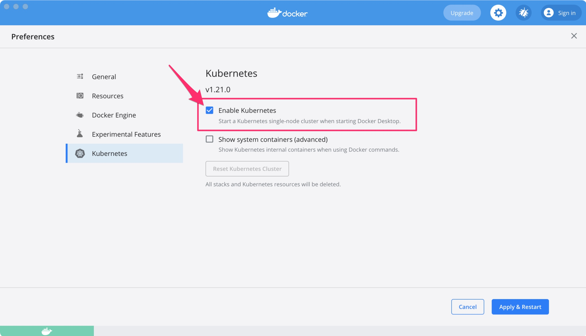

# Setup Knative on Docker Desktop

Checkout my tutorials for other kubernetes like [minikube](https://github.com/csantanapr/knative-minikube) and [kind](https://github.com/csantanapr/knative-kind).

TLDR;
```
kubectl config use-context docker-desktop
curl -sL https://raw.githubusercontent.com/csantanapr/knative-docker-desktop/main/demo.sh | sh
```

>Updated and verified on 2021/11/10 with:
>- Knative Serving 1.0.0
>- Knative Kourier 1.0.0
>- Knative Eventing 1.0.0
>- Kubernetes version 1.21.5
>- Docker Desktop version 4.2.0


## Install Docker Desktop

For information installing on MacOS or Windows checkout the [docker-deskop](https://docs.docker.com/get-docker) docs


## Enable Kubernetes

Docker Desktop includes a standalone Kubernetes server and client.

To enable Kubernetes support and install a standalone instance of Kubernetes running as a Docker container, go to **Preferences > Kubernetes** and then click Enable Kubernetes. For more info checkout out the [docs](https://docs.docker.com/desktop/kubernetes/#enable-kubernetes)



## Setup Kubernetes context

Make sure you have the current context set to `docker-desktop` for `kubectl`

```bash
kubectl config get-contexts
kubectl config use-context docker-desktop
```

If you use `kubectx` use `kubectx docker-desktop`

## Install Knative Serving

1. Select the version of Knative Serving to install
    ```bash
    export KNATIVE_VERSION="1.0.0"
    ```
1. Install Knative Serving in namespace `knative-serving`
    ```bash
    kubectl apply -f https://github.com/knative/serving/releases/download/knative-v${KNATIVE_VERSION}/serving-crds.yaml
    kubectl wait --for=condition=Established --all crd

    kubectl apply -f https://github.com/knative/serving/releases/download/knative-v${KNATIVE_VERSION}/serving-core.yaml

    kubectl wait pod --timeout=-1s --for=condition=Ready -l '!job-name' -n knative-serving > /dev/null
    ```
1. Select the version of Knative Net Kourier to install
    ```bash
    export KNATIVE_NET_KOURIER_VERSION="1.0.0"
    ```

1. Install Knative Layer kourier in namespace `kourier-system`
    ```bash
    kubectl apply -f https://github.com/knative/net-kourier/releases/download/knative-v${KNATIVE_NET_KOURIER_VERSION}/kourier.yaml
    kubectl wait pod --timeout=-1s --for=condition=Ready -l '!job-name' -n kourier-system
    kubectl wait pod --timeout=-1s --for=condition=Ready -l '!job-name' -n knative-serving
    ```
1. Set the environment variable `EXTERNAL_IP` to External IP Address of the Worker Node, you might need to run this command multiple times until service is ready.
    ```bash
    EXTERNAL_IP=$(kubectl -n kourier-system get service kourier -o jsonpath='{.status.loadBalancer.ingress[0].hostname}')
    echo EXTERNAL_IP=$EXTERNAL_IP
    ```
2. Set the environment variable `KNATIVE_DOMAIN` as the DNS domain using `nip.io`
    ```bash
    KNATIVE_DOMAIN="$EXTERNAL_IP.nip.io"
    echo KNATIVE_DOMAIN=$KNATIVE_DOMAIN
    ```
    Double-check DNS is resolving
    ```bash
    dig $KNATIVE_DOMAIN
    ```
1. Configure DNS for Knative Serving
    ```bash
    kubectl patch configmap -n knative-serving config-domain -p "{\"data\": {\"$KNATIVE_DOMAIN\": \"\"}}"
    ```
1. Configure Knative to use Kourier
    ```bash
    kubectl patch configmap/config-network \
      --namespace knative-serving \
      --type merge \
      --patch '{"data":{"ingress.class":"kourier.ingress.networking.knative.dev"}}'
    ```
1. Verify that Knative is Installed properly all pods should be in `Running` state and our `kourier-ingress` service configured.
    ```bash
    kubectl get pods -n knative-serving
    kubectl get pods -n kourier-system
    kubectl get svc  -n kourier-system
    ```


## Deploy Knative Serving Application

Deploy using [kn](https://github.com/knative/client)
```bash
kn service create hello \
--image gcr.io/knative-samples/helloworld-go \
--port 8080 \
--env TARGET=Knative
```

**Optional:** Deploy a Knative Service using the equivalent yaml manifest:
```bash
cat <<EOF | kubectl apply -f -
apiVersion: serving.knative.dev/v1
kind: Service
metadata:
  name: hello
spec:
  template:
    spec:
      containers:
        - image: gcr.io/knative-samples/helloworld-go
          ports:
            - containerPort: 8080
          env:
            - name: TARGET
              value: "Knative"
EOF
```

Wait for Knative Service to be Ready
```bash
kubectl wait ksvc hello --all --timeout=-1s --for=condition=Ready
```

Get the URL of the new Service
```bash
SERVICE_URL=$(kubectl get ksvc hello -o jsonpath='{.status.url}')
echo $SERVICE_URL
```

Test the App
```bash
curl $SERVICE_URL
```

The output should be:
```
Hello Knative!
```

Check the knative pods that scaled from zero
```
kubectl get pod -l serving.knative.dev/service=hello
```

The output should be:
```
NAME                                     READY   STATUS    RESTARTS   AGE
hello-r4vz7-deployment-c5d4b88f7-ks95l   2/2     Running   0          7s
```

Try the service `url` on your browser (command works on linux and macos)
```bash
open $SERVICE_URL
```

You can watch the pods and see how they scale down to zero after http traffic stops to the url
```
kubectl get pod -l serving.knative.dev/service=hello -w
```

The output should look like this:
```
NAME                                     READY   STATUS
hello-r4vz7-deployment-c5d4b88f7-ks95l   2/2     Running
hello-r4vz7-deployment-c5d4b88f7-ks95l   2/2     Terminating
hello-r4vz7-deployment-c5d4b88f7-ks95l   1/2     Terminating
hello-r4vz7-deployment-c5d4b88f7-ks95l   0/2     Terminating
```

Try to access the url again, and you will see a new pod running again.
```
NAME                                     READY   STATUS
hello-r4vz7-deployment-c5d4b88f7-rr8cd   0/2     Pending
hello-r4vz7-deployment-c5d4b88f7-rr8cd   0/2     ContainerCreating
hello-r4vz7-deployment-c5d4b88f7-rr8cd   1/2     Running
hello-r4vz7-deployment-c5d4b88f7-rr8cd   2/2     Running
```

Some people call this **Serverless** 🎉 🌮 🔥


## Install Knative Eventing

1. Select the version of Knative Eventing to install
    ```bash
    export KNATIVE_EVENTING_VERSION="1.0.1"
    ```
1. Install Knative Eventing in namespace `knative-eventing`
    ```bash
    kubectl apply --filename https://github.com/knative/eventing/releases/download/knative-v${KNATIVE_EVENTING_VERSION}/eventing-crds.yaml
    kubectl wait --for=condition=Established --all crd

    kubectl apply --filename https://github.com/knative/eventing/releases/download/knative-v${KNATIVE_EVENTING_VERSION}/eventing-core.yaml

    kubectl wait pod --timeout=-1s --for=condition=Ready -l '!job-name' -n knative-eventing

    kubectl apply --filename https://github.com/knative/eventing/releases/download/knative-v${KNATIVE_EVENTING_VERSION}/in-memory-channel.yaml

    kubectl wait pod --timeout=-1s --for=condition=Ready -l '!job-name' -n knative-eventing

    kubectl apply --filename https://github.com/knative/eventing/releases/download/knative-v${KNATIVE_EVENTING_VERSION}/mt-channel-broker.yaml

    kubectl wait pod --timeout=-1s --for=condition=Ready -l '!job-name' -n knative-eventing

    ```

## Deploy Knative Eventing Application

- Set the example Namspace
    ```bash
    NAMESPACE=default
    ```

- Create a broker
    ```yaml
    kubectl apply -f - <<EOF
    apiVersion: eventing.knative.dev/v1
    kind: broker
    metadata:
      name: example-broker
      namespace: $NAMESPACE
    EOF
    ```

- Verify broker
    ```bash
    kubectl -n $NAMESPACE get broker example-broker
    ```

- Shoud print the address of the broker
    ```
    NAME             URL                                                                               AGE   READY   REASON
    example-broker   http://broker-ingress.knative-eventing.svc.cluster.local/default/example-broker   47s   True
    ```

- To deploy the `hello-display` consumer to your cluster, run the following command:
    ```yaml
    kubectl -n $NAMESPACE apply -f - << EOF
    apiVersion: apps/v1
    kind: Deployment
    metadata:
      name: hello-display
    spec:
      replicas: 1
      selector:
        matchLabels: &labels
          app: hello-display
      template:
        metadata:
          labels: *labels
        spec:
          containers:
            - name: event-display
              image: gcr.io/knative-releases/knative.dev/eventing-contrib/cmd/event_display

    ---

    kind: Service
    apiVersion: v1
    metadata:
      name: hello-display
    spec:
      selector:
        app: hello-display
      ports:
      - protocol: TCP
        port: 80
        targetPort: 8080
    EOF

    ```

- Create a trigger by entering the following command:
    ```yaml
    kubectl -n $NAMESPACE apply -f - << EOF
    apiVersion: eventing.knative.dev/v1
    kind: Trigger
    metadata:
      name: hello-display
    spec:
      broker: example-broker
      filter:
        attributes:
          type: greeting
      subscriber:
        ref:
          apiVersion: v1
          kind: Service
          name: hello-display
    EOF

    ```

- Install Knative DomainMapping
    ```bash
    kubectl apply -f https://github.com/knative/serving/releases/download/v$KNATIVE_VERSION/serving-domainmapping-crds.yaml
    kubectl wait --for=condition=Established --all crd
    kubectl apply -f https://github.com/knative/serving/releases/download/v$KNATIVE_VERSION/serving-domainmapping.yaml
    ```

- Enable broker domain for DomainMapping
    ```yaml
    kubectl apply -f - <<EOF
    apiVersion: networking.internal.knative.dev/v1alpha1
    kind: ClusterDomainClaim
    metadata:
      name: broker-ingress.knative-eventing.127.0.0.1.nip.io
    spec:
      namespace: knative-eventing
    EOF
    ```

- Expose broker externally using DomainMapping CRD on `broker-ingress.knative-eventing.127.0.0.1.nip.io`
    ```yaml
    kubectl -n knative-eventing apply -f - << EOF
    apiVersion: serving.knative.dev/v1alpha1
    kind: DomainMapping
    metadata:
      name: broker-ingress.knative-eventing.127.0.0.1.nip.io
    spec:
      ref:
        name: broker-ingress
        kind: Service
        apiVersion: v1
    EOF

    ```

- Send a Cloud Event usnig `curl` pod created in the previous step.
    ```bash
    curl -s -v  "http://broker-ingress.knative-eventing.127.0.0.1.nip.io/$NAMESPACE/example-broker" \
      -X POST \
      -H "Ce-Id: say-hello" \
      -H "Ce-Specversion: 1.0" \
      -H "Ce-Type: greeting" \
      -H "Ce-Source: not-sendoff" \
      -H "Content-Type: application/json" \
      -d '{"msg":"Hello Knative!"}'
    ```

- Verify the events were received
    ```bash
    kubectl -n $NAMESPACE logs -l app=hello-display --tail=100
    ```

- Successful events should look like this
    ```yaml
    Context Attributes,
      specversion: 1.0
      type: greeting
      source: not-sendoff
      id: say-hello
      datacontenttype: application/json
    Extensions,
      knativearrivaltime: 2020-11-06T18:29:10.448647713Z
      knativehistory: default-kne-trigger-kn-channel.default.svc.cluster.local
    Data,
      {
        "msg": "Hello Knative!"
      }
    ```

If you have any issues with these instructions [open an new issue](https://github.com/csantanapr/knative-minikube/issues/new) please 🙏🏻

